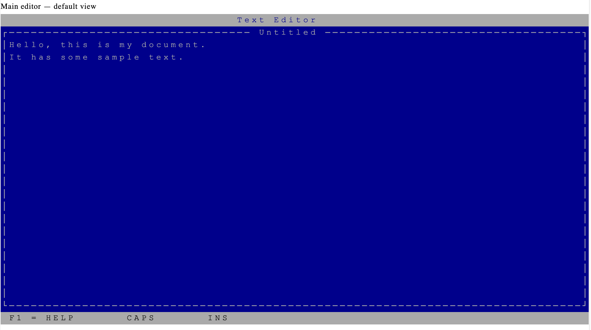
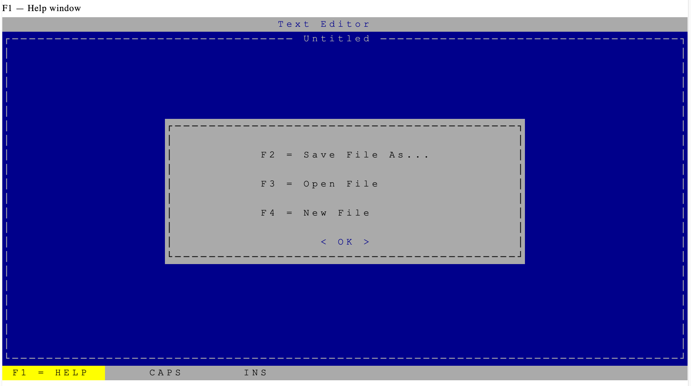
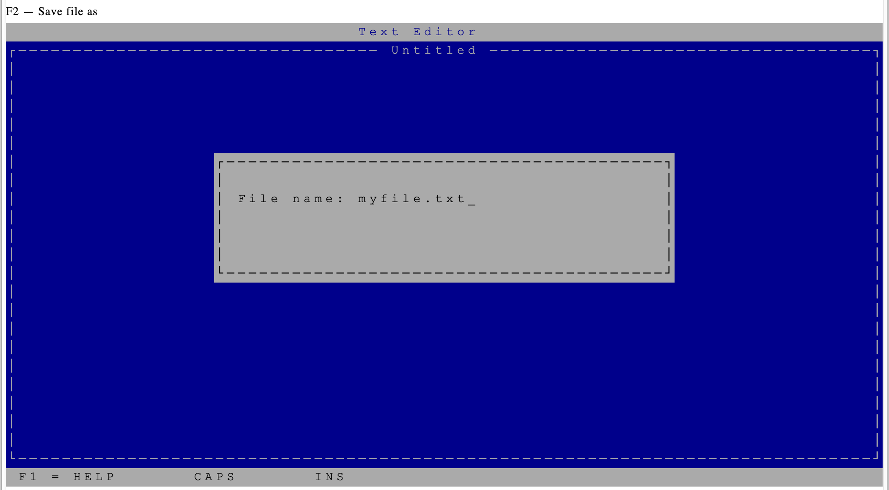
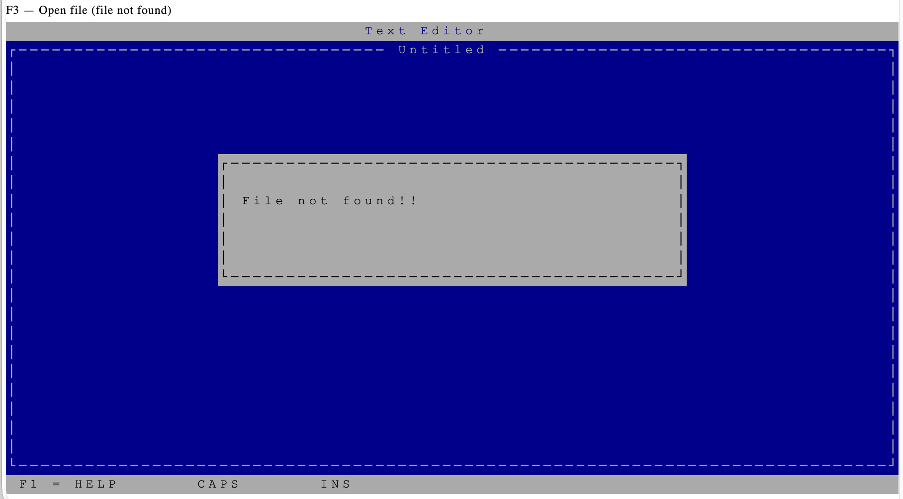

# Text Editor — x86 Assembly DOS

A lightweight, full-screen text editor written entirely in x86 assembly language, targeting the DOS environment. Built to run in an 80×25 character terminal, it provides a complete writing and file management experience using only BIOS and DOS interrupts — no libraries, no runtime, just raw assembly.

I wrote this text editor back around 2008 during my university days. It wasn't anything fancy—just a project I cobbled together to test out of my microprocessors final exam.

---

## Screenshots

**Main editor**


**F1 — Help window**


**F2 — Save file as**


**F3 — Open file / File not found**


---

## Target processor

This program was written for the **Intel 8086 / 8088** family and is compatible with the full **x86 real-mode** processor line:

- Intel 8086 / 8088
- Intel 80186 / 80188
- Intel 80286 (real mode)
- Intel 80386 / 80486 (real mode)
- Any modern x86 / x86-64 CPU running a DOS environment or emulator (e.g. DOSBox)

The code uses the `.model tiny` directive, producing a single-segment `.COM` executable — the simplest and most portable DOS binary format. It relies exclusively on:

- **INT 10h** — BIOS video services (cursor positioning, character/attribute writing)
- **INT 16h** — BIOS keyboard services (raw keycode reading)
- **INT 21h** — DOS services (file I/O, string output, program exit)

No protected-mode instructions or FPU operations are used, so the binary runs on the original 8086 without modification.

---

## Features

- **Full-screen editing** across a dark-blue 80×25 terminal canvas
- **File operations** via function keys — save, open, and new file without leaving the editor
- **Insert mode** — toggle between overwrite and insert; existing characters shift right as you type
- **Caps Lock indicator** — visual feedback in the status bar when caps are active
- **Modal dialogs** — help menu and file-name prompts rendered as pop-up windows over the editor
- **Graceful error handling** — displays "File not found!!" when an opened file doesn't exist
- **Minimal footprint** — compiled as a `.COM` binary, fits entirely in a single 64 KB segment

---

## Interface

| Zone | Rows | Description |
|---|---|---|
| Title bar | 0 | App name and current filename (or "Untitled") |
| Editing area | 1 – 23 | Dark-blue text canvas, bordered with single-line box characters |
| Status bar | 24 | Key reference and CAPS / INS toggle indicators |

---

## Key bindings

| Key | Action |
|---|---|
| `F1` | Open help window |
| `F2` | Save file as… |
| `F3` | Open file |
| `F4` | New file (clears the canvas) |
| `F5` | Exit to DOS |
| `Insert` | Toggle insert / overwrite mode |
| `Caps Lock` | Toggle caps indicator |
| `Arrow keys` | Move cursor |
| `Home` | Jump to start of line |
| `End` | Jump to end of line |
| `Enter` | Insert line break and move to next line |
| `Backspace` | Delete character and shift line left |

---

## Building

Assemble with **MASM** (Microsoft Macro Assembler) or any compatible assembler:

```bat
masm editor.asm;
link editor.obj;
exe2bin editor.exe editor.com
```

Or with **TASM** (Turbo Assembler):

```bat
tasm editor.asm
tlink /t editor.obj
```

The `/t` flag on TLINK produces a `.COM` file directly, matching the `.model tiny` directive.

---

## Running

Run natively under **MS-DOS**, **FreeDOS**, or any DOS-compatible environment. On modern systems, use [DOSBox](https://www.dosbox.com):

```bat
dosbox editor.com
```
